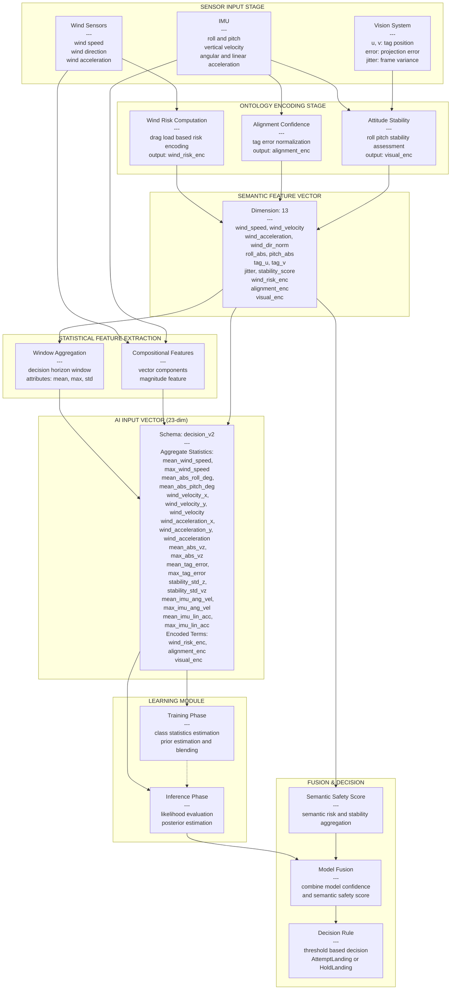

# IICC26 Workspace

## 📹 Demo Video


IICC26 워크스페이스는 ROS2+Gazebo 시뮬레이션과 MATLAB `AutoSim`을 결합해, 바람 외란 환경에서 드론 착륙 의사결정(AttemptLanding vs HoldLanding)을 연구하는 통합 실험 환경이다.

## 최근 업데이트 (2026-03-23)

이번 업데이트의 핵심은 바람 위험도를 항력 물리량 기반으로 계산하도록 정렬하고, 수집 타임아웃 상한을 고정한 것이다.

- 온톨로지 바람 위험도는 풍속 벡터로부터 항력을 계산해 하중 비율로 평가한다.
- 바람 가속도는 gust gain으로 반영해 급격한 외란에서 위험도를 보수적으로 증폭한다.
- 드론 1대 기준 데이터 수집은 시나리오당 최대 120초를 넘지 않도록 하드 타임아웃을 적용했다.

항력 기반 위험도 요약식:

$$
\mathbf{v}_w = [v_x, v_y]^\top,\quad
\mathbf{a}_w = [a_x, a_y]^\top,
v = \max\left(\|\mathbf{v}_w\|_2, \max(|v_x|, |v_y|)\right)
$$

$$
F_d = \frac{1}{2}\rho C_d A v^2
$$

$$
r_d = \frac{F_d}{F_{cap}},\quad
v_{eq} = v_{unsafe}\cdot\sqrt{r_d}
$$

$$
c_{tilt}=\cos(|roll|)\cos(|pitch|),\quad
T_{req}=\frac{mg}{\max(c_{tilt},c_{min})},\quad
F_{cap}=\max(T_{max}-T_{req},F_{min})
$$

$$
r_{wind} = \max\left(v,\ v_{eq}\right)
$$

수집 시간 상한식:

$$
t_{collect} \le 120\ \text{s per drone}
$$

## 연구 목표

- 바람/시각 정렬 오차/자세 안정성의 결합 위험도를 정량화한다.
- 온톨로지 규칙 기반 의미론 판단과 데이터 기반 모델 추론을 결합한다.
- 위험 착륙(unsafe landing)을 낮추면서도 안전 착륙 기회를 과도하게 버리지 않는 정책을 설계한다.

## 이론 배경

### 1) 바람 하중 기반 물리 한계

드론이 횡풍을 버틸 수 있는 최대 조건을, 기울기 보정 추력 여유와 항력 평형으로 근사한다.

$$
F_d = \frac{1}{2}\rho C_d A v^2
$$

$$
c_{tilt}=\cos(|roll|)\cos(|pitch|),\quad
T_{req}=\frac{mg}{\max(c_{tilt},c_{min})},\quad
F_{cap}=\max(T_{max}-T_{req},F_{min})
$$

$$
v_{hover\_{limit}} = \sqrt{\frac{2F_{cap}}{\rho C_d A}}
$$

착륙 구간은 호버보다 보수적으로 제한한다.

$$
v_{landing\_{limit}} = \alpha \cdot v_{hover\_limit}, \quad \alpha \approx 0.5
$$

### 2) 온톨로지+AI 결합 판단

최종 착륙 점수는 모델 확률과 의미론적 안전 점수의 가중 결합으로 구성한다.

$$
s_{fusion} = w_m \cdot p_{model}(safe) + (1-w_m) \cdot s_{semantic}
$$

- `s_semantic`: 온톨로지 규칙(풍하중 위험, 시각 신뢰도, 자세 안정성) 기반 안전도
- `p_model(safe)`: 학습 모델의 안전 착륙 확률
- `w_m`: 의미론 충돌/주의 상태에서 자동 축소되는 적응 가중치

최종 정책은 임계값 비교로 이진화한다.

$$
\hat{y} =
\begin{cases}
\mathrm{AttemptLanding}, & s_{fusion} \ge \tau \\
\mathrm{HoldLanding}, & s_{fusion} < \tau
\end{cases}
$$

### 3) 평가 지표

혼동행렬 원소를 $TP, FP, FN, TN$으로 둘 때,

$$
\mathrm{Accuracy} = \frac{TP+TN}{TP+FP+FN+TN}
$$

$$
\mathrm{Precision} = \frac{TP}{TP+FP}, \quad
\mathrm{Recall} = \frac{TP}{TP+FN}
$$

$$
\mathrm{Specificity} = \frac{TN}{TN+FP}
$$

$$
\mathrm{Balanced\ Accuracy} = \frac{\mathrm{Recall}+\mathrm{Specificity}}{2}
$$

$$
\mathrm{Unsafe\ Landing\ Rate} = \frac{FP}{FP+TN}
$$

본 연구에서는 단순 정확도보다 `Unsafe Landing Rate`, `Specificity`, `Balanced Accuracy`를 핵심 안전 지표로 본다.

## 데이터 처리 파이프라인 (Sensor to Decision)

다음은 센서 입력에서 최종 착륙 의사결정까지의 전체 데이터 흐름을 나타냅니다. 각 단계에서 의미론적 특성과 통계적 특성이 함께 추출되어 의사결정을 위한 정보로 조합됩니다.



### 파이프라인 단계별 설명

**1) 센서 입력 (Sensor Input Stage)**
- 풍속, 풍향, 가속도 센서
- IMU (roll, pitch, vertical velocity, angular/linear acceleration)
- AprilTag 비전 시스템 (태그 위치, 투영 오차, 프레임 간 떨림)

**2) 온톨로지 인코딩 (Ontology Encoding Stage)**

각 센서 도메인을 의미론적 점수로 변환합니다.

- **풍하중 위험도 $r_w$**: 항력 하중 비율로부터 계산된 정규화 위험도 (0~1)
- **정렬 신뢰도 $c_v$**: 태그 투영 오차로부터 비전 정렬 품질 평가
- **자세 안정도 $s_a$**: Roll/Pitch 각도의 지수 감쇠 모델로 자세 안정성 평가

**3) 의미론적 특성 벡터 (Semantic Feature Vector)**

13차원 벡터로 온톨로지 규칙 평가에 직접 사용됩니다.

**4) 통계적 특성 추출 (Statistical Feature Extraction)**

결정 윈도우 $T_{window}$ 내의 데이터로부터:
- 평균(mean), 최대값(max), 표준편차(std) 계산
- 벡터 성분($x$, $y$)과 크기(magnitude) 동시 보존

**5) AI 입력 벡터 (23-dim Decision Schema)**

통계 특성(20개) + 온톨로지 인코딩(3개)으로 구성된 최종 입력 벡터

**6) 학습 모듈 (Gaussian Naive Bayes)**

- **학습**: 클래스별 평균, 분산, 사전확률 추정 (클래스 불균형 보정용 사전 혼합)
- **추론**: 우도(likelihood)와 사전확률의 로그합으로부터 사후확률 계산

**7) 융합 및 의사결정 (Fusion & Decision)**

의미론적 점수와 모델 확률을 가중 결합하여 최종 착륙 판단 생성:

$$s_{fusion} = w_m \cdot p_{model}(safe) + (1-w_m) \cdot s_{semantic}$$

임계값 비교로 이진 의사결정:
$$\hat{y} = \begin{cases} \mathrm{AttemptLanding}, & s_{fusion} \ge \tau \\ \mathrm{HoldLanding}, & s_{fusion} < \tau \end{cases}$$

## 워크스페이스 구조

- `src/sjtu_drone-ros2/`: 실제 연구 코드 저장소
- `build/`, `install/`, `log/`: `colcon` 산출물
- `src/Diagram/`: 논문/도식/정리 문서
- `matlab_msg_ws/`: MATLAB 메시지 연동 산출물

핵심 실행 단위:

- `sjtu_drone_bringup`: 시뮬레이터/브리지/런치
- `sjtu_drone_description`: 모델/월드/풍속 플러그인
- `sjtu_drone_control`: 기본 제어 노드
- `sjtu_drone_interfaces`: `SetWind` 인터페이스
- `matlab/AutoSimMain.m`, `matlab/AutoSim.m`: 자동 실험 파이프라인

## AutoSim 모듈 구조

최근 리팩터링으로 AutoSim은 메인 오케스트레이션과 기능 모듈을 분리한 구조를 사용한다.

- `matlab/AutoSim.m`: 시나리오 루프, 예외 처리, 저장/종료 같은 실행 흐름만 담당
- `matlab/modules/core/`: 기능별 함수 모듈(ROS I/O, 제어, 온톨로지, 학습/평가, 시각화)
- `matlab/modules/`: 엔진 단위 모듈(`autosim_ai_engine`, `autosim_learning_engine`, `autosim_ontology_engine`)

운영 원칙은 기능 로직은 모듈 파일에서 관리하고, 메인 코드는 모듈 호출 중심으로 짧게 유지하는 것이다.

## 빠른 시작

```bash
cd /home/j/INCSL/IICC26_ws
source /opt/ros/humble/setup.bash
colcon build --symlink-install
source /home/j/INCSL/IICC26_ws/install/setup.bash
```

```matlab
AutoSimMain
```

## 병렬 학습 운영 (AutoSim 멀티 워커)

멀티 Gazebo 학습은 워커별 `ROS_DOMAIN_ID`, Gazebo 포트, 출력 경로를 분리해 충돌 없이 병렬 수집하도록 구성한다.

권장 워커 수는 CPU/메모리 한계를 동시에 고려해 계산한다.

$$
N_{auto} = \min\left(\max(1, C_{total}-C_{reserve}),\ \max\left(1,\left\lfloor\frac{M_{available}-M_{reserve}}{M_{per\_worker}}\right\rfloor\right)\right)
$$

실행/중지/병합:

```bash
cd /home/j/INCSL/IICC26_ws/src/sjtu_drone-ros2
matlab/scripts/run_autosim_parallel.sh auto
matlab/scripts/stop_autosim_parallel.sh
python3 matlab/scripts/merge_autosim_results.py matlab/parallel_runs/<session_root>
```

상세 운영 가이드는 다음 문서를 참고한다.

- `src/sjtu_drone-ros2/README.md`
- `src/sjtu_drone-ros2/matlab/README.md`

또는

```matlab
run('/home/j/INCSL/IICC26_ws/src/sjtu_drone-ros2/matlab/AutoSim.m')
```

## 병렬 시뮬레이션 시작점

학습/데이터 수집 가속이 필요하면, 멀티 Gazebo 병렬 실행을 사용한다.

```bash
cd /home/j/INCSL/IICC26_ws/src/sjtu_drone-ros2
chmod +x scripts/backup_before_parallel.sh scripts/run_parallel_gazebo.sh scripts/stop_parallel_gazebo.sh

# 1) 백업
./scripts/backup_before_parallel.sh /home/j/INCSL/IICC26_ws

# 2) 병렬 실행(예: 4 인스턴스)
./scripts/run_parallel_gazebo.sh 4

# 3) 중지
./scripts/stop_parallel_gazebo.sh
```

이론적 처리량은 병렬 인스턴스 수 $N$와 효율 $\eta$에 대해 아래와 같이 근사할 수 있다.

$$
T_{parallel} \approx N \cdot T_{single} \cdot \eta
$$

상세 인자/주의사항은 `src/sjtu_drone-ros2/README.md`의 병렬 시뮬레이션 섹션을 참고한다.

## 운영 원칙

- 문서는 AutoSim 기반 현재 파이프라인 기준으로 유지한다.
- 실행은 `install/setup.bash` 환경 기준으로 통일한다.
- 데이터/로그/모델 스냅샷/플롯은 생성 산출물로 간주한다.

## 문서 맵

- [src/sjtu_drone-ros2/README.md](src/sjtu_drone-ros2/README.md)
- [src/sjtu_drone-ros2/matlab/README.md](src/sjtu_drone-ros2/matlab/README.md)
- [src/sjtu_drone-ros2/sjtu_drone_description/README.md](src/sjtu_drone-ros2/sjtu_drone_description/README.md)
