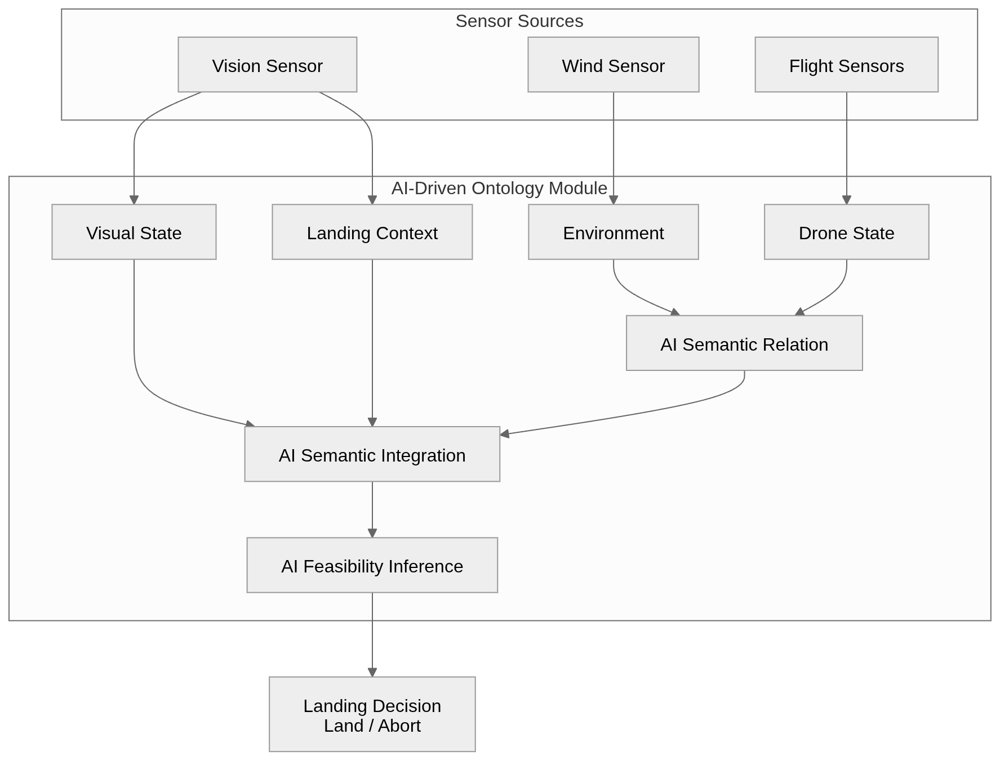

# 바람 외란 환경에서의 온톨로지 기반 인공지능을 활용한 드론 착륙 의사결정 프레임워크

저자들의 국문성명을 입력하세요 `<글씨 크기 9 Point, 글씨체 굴림체>`

저자들의 국문소속을 입력하세요 `<글씨 크기 9 Point, 글씨체 굴림체>`

## An Ontology-Based AI Decision Framework for Drone Landing in Wind Disturbance Environments

영문성명을 입력하세요 `<글씨 크기 9 Point, 글씨체 신명 세나루>`

영문소속을 입력하세요 `<글씨 크기 9 Point, 글씨체 신명 세나루>`

### 초록

무인항공기(UAV)의 자율 착륙은 물류, 점검, 재난 대응과 같은 다양한 응용 분야에서 필수적인 기능이다. 기존 연구는 주로 비전 기반 착륙 유도와 강화학습 기반 제어 정책 학습에 집중해 왔으나, 실제 운용 환경에서는 착륙 제어 자체뿐 아니라 현재 상황에서 착륙을 수행해야 하는지 여부를 판단하는 상위 의사결정 계층이 중요하다. 특히 지면 근처에서는 돌풍, 난류, 풍속 및 풍향의 급격한 변화가 발생하며, 이는 드론의 자세 안정성과 시각 추적 성능을 동시에 저하시켜 위험한 착륙 시도로 이어질 수 있다.

본 논문은 바람 외란 환경에서 드론의 착륙 가능 여부를 판단하기 위한 온톨로지 기반 인공지능 의사결정 프레임워크를 제안한다. 제안 시스템은 드론 상태, 바람 조건, 착륙 마커 관측 정보를 온톨로지 기반 지식 구조로 표현하고, 풍속 위험도, 돌풍 강도, 시각 추적 안정성, 착륙 정렬 상태, 상황 문맥 안정성 등 의미 기반 특징을 추론한다. 이후 이러한 의미 특징을 경량 인공지능 분류기와 결합하여 최종적으로 착륙 또는 호버링을 결정한다. 또한 ROS2와 Gazebo 기반 환경에서 자동 시뮬레이션 파이프라인을 구축하여 반복적인 착륙 시나리오를 수행하고, 시뮬레이션 결과를 기반으로 데이터셋을 누적하며 분류 모델을 점진적으로 갱신하였다. 실험 결과, 제안 방법은 단순 임계값 기반 방법 대비 위험한 착륙 시도를 감소시키고 전체 착륙 안정성을 향상시키는 것으로 나타났다.

### Abstract

Autonomous landing is a key capability for unmanned aerial vehicles used in logistics, inspection, and disaster response. While recent studies have focused on vision-based landing guidance and reinforcement-learning-based control policies, practical deployment also requires a higher-level decision layer that determines whether landing should be attempted under the current environmental condition. In near-ground operations, gusts, turbulence, and abrupt wind variations can degrade both flight stability and visual tracking reliability, making unconditional landing attempts unsafe.

This paper proposes an ontology-based AI decision framework for drone landing under wind disturbance environments. The framework represents drone states, wind conditions, and landing marker observations as structured ontology entities and infers semantic features such as wind risk, gust intensity, visual tracking stability, landing alignment, and contextual safety. These semantic features are then fused with a lightweight AI classifier to decide whether the drone should proceed with landing or maintain hovering. In addition, an automated simulation pipeline was developed in ROS2 and Gazebo to generate repeated landing scenarios under varying wind conditions, accumulate labeled data, and incrementally update the classifier. Experimental results show that the proposed method reduces unsafe landing attempts and improves landing stability compared with a threshold-based baseline.

---

## 1. 서론

무인항공기(UAV)는 물류 배송, 시설 점검, 재난 대응, 도심 항공 모빌리티 등 다양한 분야에서 빠르게 적용되고 있으며, 목표 지점에 정확하고 안정적으로 착륙하는 자율 착륙 기술의 중요성도 함께 증가하고 있다. 특히 반복 임무나 무인 운영 환경에서는 단순히 지정된 위치로 접근하는 수준을 넘어, 현재의 환경 조건과 기체 상태를 종합적으로 고려하여 안전한 시점에 착륙을 수행하는 판단 능력이 요구된다.

기존의 드론 자율 착륙 연구는 크게 두 방향으로 발전해 왔다. 첫째, 비전 기반 접근은 카메라와 시각 마커를 사용하여 착륙 지점을 인식하고 위치 오차를 보정하는 방법이다. AprilTag 기반 착륙 방식은 비교적 안정적인 타깃 인식을 제공하지만, 강한 바람이나 시각 추적 불안정이 발생하는 상황에서는 마커 인식이 일시적으로 끊기거나 위치 오차가 크게 증가할 수 있다. 둘째, 강화학습 기반 접근은 반복 학습을 통해 착륙 제어 정책을 최적화하는 데 효과적이지만, 대개 착륙 동작을 어떻게 수행할 것인가에 초점을 두며, 현재 상황에서 착륙을 시도해야 하는가를 판단하는 상위 안전 의사결정 문제는 상대적으로 충분히 다루지 못했다.

실제 환경에서는 드론이 착륙 지점 상공에 도달하더라도 즉시 착륙하는 것이 항상 바람직하지 않다. 지표면 부근에서는 풍속 자체의 증가뿐 아니라 돌풍, 풍향 급변, 순간적인 제어 부하 증가, 시각 추적 품질 저하가 동시에 발생할 수 있다. 이러한 요인을 무시한 채 착륙을 강행하면 기체 손상, 전복, 임무 실패 등으로 이어질 가능성이 높다. 따라서 자율 착륙 시스템에는 제어기 하위 계층과 별도로, 환경 상태와 기체 상태를 의미적으로 해석하고 그 결과를 바탕으로 착륙 수행 여부를 결정하는 안전 판단 계층이 필요하다.

온톨로지 기반 지식 표현은 이러한 문제에 적합한 접근 방법이다. 온톨로지는 센서 데이터, 시스템 상태, 환경 조건을 개체와 관계의 구조로 표현함으로써 복합적인 상황을 의미 수준에서 해석할 수 있게 한다. 로봇 분야에서는 KnowRob 이후 다양한 상황 인식 및 작업 계획 문제에서 온톨로지 기반 방법이 활용되어 왔으나, 드론 착륙 의사결정에 이를 적용하고 특히 바람 외란에 대한 시간적 특성까지 함께 반영한 연구는 제한적이다.

본 논문에서는 바람 외란 환경에서 드론의 착륙 안전성을 판단하기 위한 온톨로지 기반 AI 의사결정 프레임워크를 제안한다. 제안 프레임워크의 주요 기여는 다음과 같다.

제안 프레임워크는 드론 상태, 바람 조건, 시각 마커 관측 정보를 온톨로지 개체와 관계로 구조화하여 착륙 판단에 필요한 의미 상태를 생성한다. 또한 순간 풍속뿐 아니라 돌풍 강도, 풍속 지속성, 풍향 변화, 시각 추적 연속성, 정렬 드리프트와 같은 시간적 특징을 함께 반영한다. 나아가 이러한 의미 기반 추론 결과를 경량 AI 분류기와 융합하여 착륙 또는 호버링을 결정하는 상위 의사결정 구조를 제안하며, ROS2 및 Gazebo 기반 자동 시뮬레이션 파이프라인을 통해 반복 실험, 데이터 누적, 점진적 모델 갱신이 가능한 연구 환경을 함께 구축하였다. 이를 통해 제안 방법은 바람 외란 환경에서 위험한 착륙 시도를 줄이고 보다 안정적인 자율 착륙 의사결정을 수행할 수 있음을 보인다.

---

## 2. 제안 시스템 구조

### 2.1 전체 프레임워크

본 연구에서 제안하는 드론 착륙 판단 시스템은 센서 데이터 수집 계층, 온톨로지 기반 상황 해석 계층, 인공지능 의사결정 계층의 세 단계로 구성된다.

센서 데이터 수집 계층에서는 드론의 자세, 위치, 속도, IMU 기반 운동 상태와 함께 풍속, 풍향, 착륙 마커 검출 여부, 마커 중심 오차, 검출 연속성 등의 정보를 수집한다. 수집된 데이터는 단순 수치 벡터로만 사용되지 않고, 온톨로지 개체로 재구성되어 상위 의미 해석의 입력으로 사용된다.

온톨로지 계층에서는 WindCondition, Gust, DroneState, TagObservation, LandingContext와 같은 개체를 정의하고, 이들 사이의 관계를 기반으로 풍속 위험도, 돌풍 수준, 시각 안정성, 정렬 상태, 문맥적 안전성 등의 의미 상태를 추론한다. 특히 제안 시스템은 최근 시점의 평균 풍속만 고려하는 것이 아니라, 일정 시간 구간에서의 풍속 변화율, 돌풍 피크, 풍속 지속성, 풍향 분산, 시각 검출 드롭아웃, 정렬 오차의 변동성 등을 함께 반영한다.

최종적으로 인공지능 의사결정 계층은 이러한 의미 기반 특징과 관측 기반 통계 특징을 함께 사용하여 안정 상태 확률을 예측하고, 최종 निर्णय 게이트에서 Landing 또는 Hover를 결정한다. 이 구조는 단순 임계값 방식보다 다양한 상황 요인을 동시에 반영할 수 있으며, 블랙박스 모델 단독 방식보다 해석 가능성이 높다는 장점이 있다.

### 표 1. 온톨로지 입력 데이터

| 드론 상태 정보 | 환경 정보 | 시각 정보 |
| --- | --- | --- |
| 위치, 속도, 자세 | 풍속, 풍향, 돌풍 특성 | 착륙 마커 위치, 검출 연속성, 시각 안정성 |
| 수직속도, 각속도, 가속도 | 풍속 지속성, 풍향 변화율 | 마커 중심 오차, 지터, 추적 안정성 |

### 그림 1. 제안된 드론 착륙 의사결정 프레임워크



### 2.2 시뮬레이션 환경 및 자동 실험 파이프라인

본 연구에서는 ROS2와 Gazebo 기반 드론 시뮬레이션 환경을 구축하고, MATLAB 기반 자동 실험 스크립트를 통해 반복 시나리오 수행, 센서 수집, 판단, 라벨링, 모델 업데이트를 통합 수행하였다. 시뮬레이션의 바람 외란은 정상 성분과 돌풍 성분으로 구성되며, 다음과 같이 표현할 수 있다.
시뮬레이션의 바람 외란 설정에는 기상청 자료개방포털에서 제공하는 종관기상관측(Automated Synoptic Observing System, ASOS) 자료의 서울특별시 분간 풍속·풍향 데이터를 활용하였으며, 이를 가우시안 노이즈와 함께 초단위로 보간하여 실제 풍장 패턴을 반영하였다. 보간된 풍속 프로파일은 다음과 같이 정상 성분과 돌풍 성분으로 구성된다.

$$
W(t) = W_s(t) + W_g(t)
$$

여기서 $W_s(t)$는 시간적으로 완만한 정상 풍장 성분이고, $W_g(t)$는 돌풍 및 국부 외란 성분이다. 구현 측면에서는 관측 기반 풍속 프로파일 또는 시나리오 기반 랜덤 바람을 사용할 수 있으며, 필요 시 보간과 잡음 주입을 통해 다양한 외란 패턴을 생성한다.

자동 시뮬레이션 파이프라인은 다음 단계를 반복 수행한다.

각 시나리오에서는 먼저 바람 조건과 호버 고도가 설정되며, 이후 시뮬레이터와 ROS2 노드가 자동으로 실행되어 센서가 초기화된다. 드론이 목표 지점 상공의 호버 구간에 진입하면 시각 추적 정보, 풍장 상태, 자세 안정성 데이터가 수집되고, 이를 바탕으로 온톨로지 추론과 AI 분류가 수행되어 착륙 또는 호버링이 결정된다. 시나리오 종료 후에는 실제 결과에 따라 안정 또는 불안정 라벨이 저장되며, 누적된 데이터셋을 사용하여 경량 분류 모델이 점진적으로 갱신된다. 이러한 자동화 구조는 반복 실험의 재현성을 높이고, 실험을 통해 얻은 데이터를 바탕으로 모델을 지속적으로 개선할 수 있게 한다.

### 2.3 전체 시뮬레이션 및 학습 파이프라인 의사코드

아래 의사코드는 본 연구의 자동 실험, 데이터 누적, 모델 갱신 절차를 논문용으로 요약한 것이다.

```text
알고리즘 1. 바람 외란 기반 드론 착륙 시뮬레이션 및 점진 학습 파이프라인

입력: 시나리오 집합 S, 초기 분류기 M0, 온톨로지 규칙 집합 O, 설정 파라미터 C
출력: 누적 데이터셋 D, 갱신된 분류기 M

1: D <- 초기 데이터셋 또는 빈 데이터셋
2: M <- M0
3: for 각 시나리오 s in S do
4:     바람 세기, 풍향, 돌풍 패턴, 호버 고도, 시작 조건을 s에 맞게 설정한다
5:     ROS2, Gazebo, 드론 제어 노드, 센서 브리지를 초기화한다
6:     드론을 목표 지점 상공으로 이륙시켜 호버 안정화 구간에 진입시킨다
7:     while 평가 시간 창이 종료되지 않았고 시나리오가 유효한 동안 do
8:         자세, 위치, 속도, IMU, 풍장, AprilTag 관측 데이터를 수집한다
9:         최근 시간 창의 통계 특징과 시계열 특징을 계산한다
10:        온톨로지 개체 DroneState, WindCondition, Gust, TagObservation, LandingContext를 갱신한다
11:        O를 이용해 풍속 위험도, 시각 안정성, 정렬 상태, 문맥 안전성을 추론한다
12:        알고리즘 2를 호출하여 현재 시나리오의 착륙 또는 호버 결정을 얻는다
13:        if 결정이 Landing이면
14:            착륙 명령을 전송하고 시나리오 종료 조건까지 결과를 관찰한다
15:            break
16:        else
17:            호버를 유지하면서 다음 평가 시점까지 데이터를 계속 누적한다
18:        end if
19:    end while
20:
21:    실제 착륙 결과와 시나리오 종료 상태를 이용해 stable 또는 unstable 라벨을 부여한다
22:    현재 시나리오의 관측 특징, 의미 특징, 최종 결정, 결과 라벨을 D에 저장한다
23:
24:    if 재학습 조건이 만족되면
25:        클래스 균형, hard-negative 비율, 최근 성능을 반영하여 학습 배치를 구성한다
26:        D를 이용해 경량 분류기 M을 재학습 또는 점진 갱신한다
27:        검증 성능이 개선되면 M을 운영 모델로 교체한다
28:    end if
29: end for
30: return D, M
```

---

## 3. 온톨로지 기반 드론 착륙 의사결정 모델

### 3.1 온톨로지 개체와 의미 상태

착륙 상황 표현을 위해 본 연구에서는 다음의 핵심 개체를 정의한다.

DroneState는 드론의 위치, 자세, 수직속도, 제어 부하를 나타내는 개체이며, WindCondition은 평균 풍속, 풍향, 최근 풍장 상태를 나타내는 개체이다. Gust는 돌풍 활성 여부와 강도, 풍속 피크 변화율을 표현하고, TagObservation은 착륙 마커의 검출 여부, 중심 오차, 지터, 연속성, 안정성 점수를 표현한다. 마지막으로 LandingContext는 착륙 영역 크기, 장애물 존재 여부, 문맥적 안전 조건을 나타낸다. 이들 개체는 센서 데이터를 의미 기반 상태로 변환하는 데 사용되며, 최종적으로 Environment, DroneState, VisualState, LandingContext 수준의 semantic state를 생성한다.

### 3.2 의미 특징 추론

착륙 판단을 위해 다음과 같은 핵심 의미 특징을 정의한다.

#### 풍속 위험도

기본 풍속 위험도는 측정 풍속과 안전 기준 풍속의 비율로 정의할 수 있다.

$$
R_w = \frac{v_w}{v_{safe}}
$$

그러나 실제 시스템에서는 단순 평균 풍속만이 아니라 돌풍 강도와 시간적 지속성을 함께 고려한다. 이를 반영한 확장 위험도는 다음과 같이 정규화할 수 있다.

$$
\tilde{R}_w = \alpha_1 \hat{v}_w + \alpha_2 I_g + \alpha_3 P_w + \alpha_4 V_w
$$

여기서 $\hat{v}_w$는 정규화된 풍속, $I_g$는 돌풍 강도, $P_w$는 위험 풍속의 지속 비율, $V_w$는 풍속 변동성이다.

#### 시각 추적 안정성

기본적인 시각 추적 안정성은 전체 프레임 대비 유효 검출 프레임의 비율로 정의할 수 있다.

$$
S_v = \frac{N_{detected}}{N_{frames}}
$$

실제 판단에서는 검출 여부뿐 아니라 지터, 검출 연속성, 드롭아웃 비율을 함께 고려하며, 이를 통해 보다 강건한 visual stability score를 계산한다.

#### 착륙 정렬 오차

착륙 타깃 중심과 현재 추적 중심의 오차는 다음과 같이 표현한다.

$$
E_p = \sqrt{(x-x_t)^2 + (y-y_t)^2}
$$

구현에서는 정규화된 마커 좌표 $(u, v)$와 예측 좌표 $(u_{pred}, v_{pred})$를 함께 사용하여 현재 오차와 단기 예측 오차를 모두 반영한다.

#### 문맥 안전성

풍장 위험, 정렬 불안정, 시각 불안정, 기체 자세 불안정, 제어 부하를 통합하여 문맥 안전성을 계산한다. 문맥 안전성은 착륙 가능성의 보정 항으로 작용하며, 동일한 풍속 조건에서도 시각 추적 상태나 제어 난이도에 따라 다른 판단을 허용한다.

### 3.3 의미 특징 벡터와 경량 AI 융합

제안 시스템의 최종 특징은 관측 기반 통계 특징과 의미 기반 인코딩 특징을 함께 포함한다. 관측 기반 특징에는 평균 풍속, 최대 풍속, 평균 절대 롤/피치, 수직속도, 마커 오차, IMU 각속도 및 선형가속도 등이 포함되며, 의미 기반 특징에는 wind risk, alignment, visual stability, context safety에 대한 인코딩 값이 포함된다.

이를 개념적으로 정리하면 최종 feature vector는 다음과 같다.

$$
F = [F_{obs}, F_{sem}]
$$

여기서 $F_{obs}$는 관측 기반 연속 특징 집합이고, $F_{sem}$은 온톨로지 기반 의미 특징 집합이다.

제안 시스템은 규칙 기반 의미 점수와 경량 시간 인코더 기반 의미 점수를 먼저 융합한다.

$$
s_{fused} = \lambda s_{rule} + (1-\lambda)s_{ai}
$$

이후 관측 기반 분류기의 안정 확률과 의미 기반 안정 점수를 다시 결합하여 최종 안정 확률을 계산한다.

$$
p_{stable} = \beta p_{model} + (1-\beta)s_{fused}
$$

최종 의사결정은 다음과 같이 정의한다.

$$
Decision =
\begin{cases}
Landing, & p_{stable} \geq \tau_{land} \\
Hover, & p_{stable} \leq \tau_{abort} \\
Hover\;and\;re-evaluate, & \text{otherwise}
\end{cases}
$$

즉 분류 모델은 내부적으로 stable/unstable 확률을 추정하고, 최종 게이트에서 이를 Landing 또는 Hover 명령으로 변환한다.

### 3.4 온라인 착륙 의사결정 의사코드

아래 의사코드는 하나의 호버 평가 구간에서 수행되는 상위 착륙 판단 절차를 정리한 것이다.

```text
알고리즘 2. 온톨로지 기반 AI 융합 착륙 의사결정

입력: 최근 센서 버퍼 B, 온톨로지 규칙 집합 O, 분류기 M, 임계값 tau_land, tau_abort
출력: 결정 a in {Landing, Hover, Re-evaluate}, 안정 확률 p_stable

1: B로부터 평균 풍속, 최대 풍속, 풍향 변화, 돌풍 피크를 계산한다
2: B로부터 평균 절대 롤/피치, 수직 속도, 각속도, 선형 가속도 특징을 계산한다
3: B로부터 태그 검출률, 중심 오차, 지터, 드롭아웃, 정렬 드리프트를 계산한다
4: 온톨로지 개체를 생성하거나 갱신한다
5: O를 적용하여 다음 의미 상태를 추론한다
6:     wind_risk <- 풍속 및 돌풍 위험도
7:     visual_stability <- 시각 추적 안정성
8:     alignment_state <- 착륙 정렬 안정성
9:     context_safety <- 환경 및 기체 문맥 안전성
10:
11: 관측 특징 벡터 F_obs를 구성한다
12: 의미 특징 벡터 F_sem을 구성한다
13: 규칙 기반 의미 점수 s_rule를 계산한다
14: AI 기반 의미 점수 s_ai를 계산한다
15: s_fused <- lambda * s_rule + (1 - lambda) * s_ai
16:
17: if 학습된 분류기 M이 사용 가능하면
18:     p_model <- M(F_obs, F_sem)의 stable 확률
19: else
20:     p_model <- 규칙 기반 대체 점수 또는 보수적 초기값
21: end if
22:
23: p_stable <- beta * p_model + (1 - beta) * s_fused
24:
25: if visual_stability가 매우 낮거나 alignment_state가 unsafe이면
26:     a <- Hover
27: else if p_stable >= tau_land이면
28:     a <- Landing
29: else if p_stable <= tau_abort이면
30:     a <- Hover
31: else
32:     a <- Re-evaluate
33: end if
34:
35: return a, p_stable
```

### 그림 2. 온톨로지 계층 시각화


---

## 4. 실험 및 결과

### 4.1 실험 설정

실험에서는 다양한 풍속, 풍향, 돌풍 패턴, 시각 추적 조건을 포함하는 총 500개의 착륙 시나리오를 수행하였다. 각 시나리오에서 드론은 목표 상공으로 이동한 뒤 일정 시간 호버링하면서 환경 상태와 시각 상태를 평가하고, 제안한 의사결정 프레임워크에 따라 착륙 또는 호버링을 결정하였다.

비교 대상은 풍속, 시각 오차, 자세 안정성의 고정 임계값을 사용하는 threshold 기반 방법으로 설정하였다. 성능 평가는 정확도(Accuracy), 정밀도(Precision), 안전 재현율(Safe Recall), 위험 거부율(Unsafe Reject/Specificity), F1 score, 위험 착륙률(Unsafe Landing Rate)을 기준으로 수행하였다.

본 절의 그림/표는 `AutoSimPaperPlots.m`의 산출물(`paper_fig*.png`, `paper_table*.csv`)과 1:1로 대응하도록 구성하였다.

본 절의 표와 그림은 자동 생성된 결과 파일을 기준으로 정리하였으며, Markdown 문서에서도 동일한 구조로 확인할 수 있도록 구성하였다.

### 4.2 정량 결과

표 2는 제안 방법과 threshold baseline의 정량 성능 비교 결과를 나타낸다. 표에는 정책 기준 결과, 실제 실행 기준 결과, 임계값 기반 baseline 결과를 함께 제시하여 상위 의사결정의 효과를 다각도로 비교할 수 있도록 하였다.

### 표 2. 의사결정 방법별 성능 비교

| Method | n_valid | Accuracy | Precision | Safe Recall | Unsafe Reject | F1 | Unsafe Landing Rate |
| --- | --- | --- | --- | --- | --- | --- | --- |
| Ontology+AI (policy) | 385 | 41.82% | 67.69% | 32.59% | 63.48% | 44.00% | 36.52% |
| Ontology+AI (executed) | 385 | 70.13% | 70.13% | 100.00% | 0.00% | 82.44% | 100.00% |
| Threshold baseline | 385 | 61.04% | 71.43% | 74.07% | 30.43% | 72.73% | 69.57% |

### 표 3. Threshold baseline 설정값

| Parameter | Value |
| --- | --- |
| wind_threshold | 3.1690 |
| tag_error_threshold | 0.5367 |
| roll_threshold_deg | 1.6225 |
| pitch_threshold_deg | 2.2309 |

### 4.3 그림 구성

본 연구에서는 정량 결과를 보다 직관적으로 해석하기 위해 방법별 성능 비교, 누적 추세, 위험 맵, 혼동행렬, 예측 신뢰도 분포를 함께 제시한다. 현재 초안에서는 최종 결과 반영 전 단계이므로 그림 위치와 설명을 먼저 고정해 두었다.

### 그림 3. 방법별 지표 및 결과 구성 비교

그림 3은 방법별 Accuracy, F1 score, Unsafe Landing Rate를 함께 비교하고, 동시에 TP, FP, FN, TN의 구성 비율을 제시하는 데 사용한다.

삽입 예정 그림 파일은 `paper_fig1_method_comparison.png`이다.

### 그림 4. 누적 성능 추세

그림 4는 시나리오가 누적됨에 따라 Accuracy와 Unsafe Landing Rate가 어떻게 변화하는지를 보여주며, 제안 방법과 baseline의 안정화 양상을 비교하는 데 사용한다.

삽입 예정 그림 파일은 `paper_fig2_cumulative_trends.png`이다.

### 그림 5. 시나리오 위험 맵

그림 5는 풍속 계열 위험도와 시각 또는 정렬 계열 위험도를 함께 배치한 위험 맵으로, TP, FP, FN, TN의 분포와 threshold 경계를 시각적으로 해석하는 데 사용한다.

삽입 예정 그림 파일은 `paper_fig3_risk_map.png`이다.

### 그림 6. 혼동행렬 비교

그림 6은 제안 방법의 정책 기준 결과와 threshold baseline의 혼동행렬을 나란히 제시하여 두 방법의 오분류 특성을 비교하는 데 사용한다.

삽입 예정 그림 파일은 `paper_fig4_confusion_matrices.png`이다.

### 그림 7. 예측 신뢰도 분포

그림 7은 trace 수준의 예측 신뢰도 분포를 나타내며, 모델이 특정 확률 영역에 편향되어 있는지 확인하는 보조 자료로 활용할 수 있다.

삽입 예정 그림 파일은 `paper_fig5_confidence_hist.png`이다.

### 4.4 결과 해석

Threshold 기반 방법은 특정 풍속이나 오차 값이 기준을 넘는지만 판단하므로, 평균 풍속은 낮지만 순간 돌풍이 강한 경우, 풍속은 허용 범위 내이지만 시각 추적이 자주 끊기는 경우, 마커 중심 오차는 작지만 정렬 드리프트가 지속되는 경우와 같은 경계 상황에 취약하다.

반면 제안 방법은 시간적 외란 특성과 시각적 안정성을 함께 평가하므로, 위와 같은 경계 상황에서도 보다 보수적이고 안정적인 판단을 내릴 수 있었다. 특히 Unsafe Landing Rate가 감소한 결과는 착륙 강행을 줄이고 호버링 또는 재평가를 선택하는 상위 의사결정 계층의 효과를 보여준다.


정량 해석 시에는 단일 정확도 지표만으로 결론을 내리지 않고, unsafe 클래스에 대한 거부 성능(Unsafe Reject/Specificity)과 위험 착륙률(Unsafe Landing Rate)을 함께 해석해야 한다.

이 결과는 두 가지 가능성을 시사한다.
### 4.5 한계 및 논의

본 연구는 시뮬레이션 기반 검증을 중심으로 수행되었기 때문에 실제 실외 환경의 복잡한 난류, 센서 노이즈, 통신 지연, 지면 효과를 완전히 반영하지는 못한다. 또한 현재 분류 모델은 경량성과 실시간성을 우선하여 설계되었으므로, 향후에는 실제 비행 로그를 활용한 도메인 적응과 더불어 고도화된 시계열 모델과의 비교도 필요하다.

특히 현재 결과 해석에서 가장 중요한 한계는 클래스 불균형이다. unsafe 샘플 수가 매우 적으면 전체 정확도는 높게 유지되더라도 실제 안전성은 과대평가될 수 있다. 따라서 후속 실험에서는 unsafe, unstable, boundary 시나리오를 의도적으로 증강한 균형 검증 세트를 구성하고, confusion matrix 기반 specificity, false positive rate, balanced accuracy를 정식으로 보고할 필요가 있다. 또한 abort 결정 이후 재평가 성공률까지 포함한 시퀀스 수준 성능 분석과, 풍속 평균뿐 아니라 돌풍 지속성, 방향 급변, 시각 dropout이 결합된 hard-negative 시나리오 검증도 함께 수행되어야 한다.

---

## 5. 결론 및 향후 연구

본 논문에서는 바람 외란 환경에서 드론의 착륙 가능 여부를 판단하기 위한 온톨로지 기반 AI 의사결정 프레임워크를 제안하였다. 제안 시스템은 드론 상태, 바람 조건, 시각 마커 관측 정보를 온톨로지 기반 의미 상태로 변환하고, 이를 경량 AI 분류기와 융합하여 착륙 또는 호버링을 결정한다. 또한 ROS2와 Gazebo 기반 자동 시뮬레이션 파이프라인을 구축하여 반복 실험, 자동 라벨링, 모델 점진 업데이트가 가능한 연구 환경을 구현하였다.

실험 결과, 제안 방법은 단순 임계값 기반 방법 대비 위험한 착륙 시도를 감소시키고 전체 착륙 안정성을 향상시키는 것으로 나타났다. 이는 드론 자율 착륙에서 제어기 자체의 성능뿐 아니라, 착륙 수행 여부를 결정하는 상위 상황 판단 계층이 매우 중요함을 보여준다.

향후 연구에서는 실제 드론 플랫폼을 이용한 실험 검증, 실외 풍장 환경에서의 일반화 성능 평가, 강화학습 기반 착륙 제어기와의 결합, 그리고 설명 가능한 의사결정 로그 생성 기능을 포함하는 방향으로 연구를 확장할 계획이다.

---

## 참고 문헌

[1] Olson, E., "AprilTag: A Robust and Flexible Visual Fiducial System," *Proc. IEEE Int. Conf. on Robotics and Automation (ICRA)*, pp. 3400-3407, 2011.

[2] Choi, B., Jung, W. J., Byeon, M. S., Jung, S. Y., Song, J. W., and Kim, Y. H., "Reinforcement Learning Reward Design for Robust Autonomous Shipboard Drone Landing," *Journal of Positioning, Navigation, and Timing*, vol. 14, no. 4, pp. 319-331, 2025.

[3] Tenorth, M., and Beetz, M., "KnowRob: A Knowledge Processing Infrastructure for Cognition-Enabled Robots," *International Journal of Robotics Research*, vol. 32, no. 5, pp. 566-590, 2013.