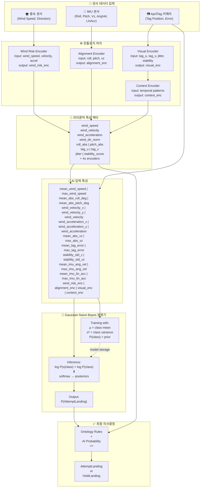

# MATLAB AutoSim Guide

이 폴더는 IICC26 드론 착륙 연구의 MATLAB 실험 파이프라인을 담당한다. 기본 진입점은 `AutoSimMain.m`이며, 내부적으로 `AutoSim.m`을 실행한다.

## 실행 목적

AutoSim은 다음 과정을 자동화한다.

- ROS2/Gazebo 실행/종료 관리
- 시나리오별 바람 외란 주입
- 센서 및 AprilTag 기반 안정성 특성 추출
- 온톨로지+AI 융합 판단(`AttemptLanding`/`HoldLanding`)
- 데이터셋 누적 및 모델 재학습
- 검증, 요약 테이블/플롯 생성

## 코드 구조 (모듈 분리)

현재 AutoSim은 메인 실행 스크립트와 기능 모듈을 분리한 구조로 정리되어 있다.

- `AutoSimMain.m`: 진입점
- `AutoSim.m`: 오케스트레이션(루프/예외/저장/종료)
- `modules/core/decision_making/`: 정책 선택, feature 조합, 지표 계산
- `modules/core/simulation/`: 시나리오 실행, 리셋, 착륙/동역학 집계
- `modules/core/ontology/`: 온톨로지 상태/관계 추론
- `modules/core/learning/`: 모델 로드/학습/예측
- `modules/core/ros_io/`: ROS2 I/O, 파싱, 콜백 관리
- `modules/core/visualization/`: 실시간/오프라인 시각화
- `modules/core/orchestration/`: 설정/체크포인트/종료 처리
- `modules/core/utils/`: 공통 유틸리티
- `modules/autosim_ai_engine.m`: AI 관련 엔진 함수
- `modules/autosim_learning_engine.m`: 학습 제어 엔진 함수
- `modules/autosim_ontology_engine.m`: 온톨로지 엔진 함수

즉, 메인에는 흐름만 남기고 기능 구현은 모듈 파일에서 관리한다.

## 실행 방법

```bash
cd /home/j/INCSL/IICC26_ws
source /opt/ros/humble/setup.bash
source /home/j/INCSL/IICC26_ws/install/setup.bash
```

```matlab
AutoSimMain
```

호환 경로:

```matlab
run('/home/j/INCSL/IICC26_ws/src/sjtu_drone-ros2/matlab/AutoSim.m')
```

## 멀티 워커 병렬 실행

AutoSim은 환경변수 오버라이드로 워커별 도메인/출력/정리 범위를 분리할 수 있다.

주요 환경변수:

- `AUTOSIM_WORKER_ID`, `AUTOSIM_WORKER_COUNT`
- `AUTOSIM_DOMAIN_ID`, `AUTOSIM_GAZEBO_PORT`
- `AUTOSIM_OUTPUT_ROOT`
- `AUTOSIM_CLEANUP_SCOPE` (`instance` 권장)
- `AUTOSIM_ENABLE_PROGRESS_PLOT`
- `AUTOSIM_ENABLE_SCENARIO_LIVE_VIZ` (기본 `false`)

병렬 실행 스크립트:

```bash
cd /home/j/INCSL/IICC26_ws/src/sjtu_drone-ros2
matlab/scripts/run_autosim_parallel.sh auto
```

중지:

```bash
matlab/scripts/stop_autosim_parallel.sh
```

## 병렬 모니터링

온톨로지 상세 라이브 시각화는 병렬 성능/가독성을 위해 기본 비활성화하고, 워커 전체 상태를 보는 필수 모니터 그래프를 사용한다.

```matlab
monitor_autosim_parallel('/home/j/INCSL/IICC26_ws/src/sjtu_drone-ros2/matlab/parallel_runs/<session_root>', 2.0)
```

## 병렬 결과 병합

```bash
python3 matlab/scripts/merge_autosim_results.py /home/j/INCSL/IICC26_ws/src/sjtu_drone-ros2/matlab/parallel_runs/<session_root>
```

병합 결과:

- `merged/autosim_dataset_merged.csv`
- `merged/autosim_trace_merged.csv`
- `merged/autosim_learning_merged.csv`

## 분석 구간 정의

유효 분석 구간:

- 시작: 목표점 도달 후 `xy_hold` 진입
- 종료: `landing_track` 이후 착륙 hold 조건 충족

제외 구간:

- 이륙 전 준비
- 목표점 도달 전 이동/상승
- 착륙 이후 관측 tail 구간

## 주요 토픽

입력:

- `/drone/gt_pose`
- `/drone/gt_vel`
- `/drone/state`
- `/wind_condition`
- `/landing_tag_state`

출력:

- `/wind_command`
- `/drone/takeoff`
- `/drone/cmd_vel`

## 데이터 흐름도: 센서 → 온톨로지 → AI

다음 다이어그램은 센서 입력부터 최종 의사결정까지의 전체 데이터 처리 파이프라인을 보여줍니다.



**주요 특징:**

- **센서 입력**: 풍속, IMU, AprilTag 카메라로부터 실시간 데이터 수집
- **온톨로지 처리**: 4개 인코더(wind_risk, alignment, visual, context)를 통해 의미론적 특성 추출
- **의미론적 벡터**: 14차원 벡터로 의미론 규칙 평가에 사용
- **AI 입력**: 24차원 벡터로 통계량(평균, 최대값, 표준편차) + 4개 인코더 조합
- **분류기**: Gaussian Naive Bayes로 AttemptLanding 확률 계산
- **최종 결정**: 온톨로지 규칙과 AI 확률을 가중 결합하여 최종 의사결정

## 판단 파이프라인

1. ROS 센서 수집
2. AprilTag 기반 시각 안정성 계산
3. 바람/자세/속도 특성 생성
4. 온톨로지 상태 추론
5. 모델 입력 벡터 구성
6. 의미론 점수와 모델 확률 융합
7. 정책 판단(`pred_decision`) 산출
8. 결과 라벨링 및 학습/검증 데이터 반영

## 최종 AI 입력 데이터 형태 (24 features)

입력 텐서: 1 x 24 실수 벡터 (double)

생성 위치:

- 스키마 정의: AutoSim.m:561
- 실제 X 생성: AutoSim.m:4022

참고(현재 모듈화 구조 기준):

- 스키마 정의: modules/core/autosimDefaultConfig.m
- 실제 X 생성: modules/core/autosimPredictModel.m, modules/core/autosimTrainGaussianNB.m

현재 모델 스키마(`decision_v2`)는 아래 24개 입력으로 고정되어 있다.

1. `mean_wind_speed`
2. `max_wind_speed`
3. `mean_abs_roll_deg`
4. `mean_abs_pitch_deg`
5. `wind_velocity_x`
6. `wind_velocity_y`
7. `wind_velocity`
8. `wind_acceleration_x`
9. `wind_acceleration_y`
10. `wind_acceleration`
11. `mean_abs_vz`
12. `max_abs_vz`
13. `mean_tag_error`
14. `max_tag_error`
15. `stability_std_z`
16. `stability_std_vz`
17. `mean_imu_ang_vel`
18. `max_imu_ang_vel`
19. `mean_imu_lin_acc`
20. `max_imu_lin_acc`
21. `wind_risk_enc`
22. `alignment_enc`
23. `visual_enc`
24. `context_enc`

중요: 풍속/가속도는 입력 직전까지 벡터 성분(`x`, `y`)으로 유지하고, 크기 특성(`wind_velocity`, `wind_acceleration`)은 별도 feature로 함께 사용한다.

## 온톨로지 객체 설계와 관계 정의

이 프로젝트의 온톨로지는 착륙 의사결정에 필요한 상태를 객체 단위로 분해하고, 객체 간 관계를 규칙과 수식으로 결합해 의미론 점수(semantic score)를 계산하도록 설계한다.

### 1) 객체(클래스) 구성

- `MissionState`: 현재 임무 단계(접근, `xy_hold`, 착륙 추적 등)
- `WindState`: 풍속, 풍향, 가속도(변동성 포함)
- `VisionState`: 태그 검출 여부, 중심 오차, 태그 면적/신뢰도
- `AttitudeState`: roll/pitch 절대값, 자세 안정성
- `VehicleState`: 위치/속도/상태 코드(landed, flying 등)
- `SafetyState`: 안전 여유(풍하중 대비 추력 여유, 시각 신뢰도, 자세 안정도)
- `DecisionState`: 최종 권고(`AttemptLanding` 또는 `HoldLanding`)

실제 구현에서는 위 객체를 특징 벡터와 인코딩 상태(`context_enc`, `visual_enc`, `wind_risk_enc`)로 변환해 규칙 평가와 모델 결합에 사용한다.

### 2) 객체 간 관계(그래프) 설계

핵심 연결은 다음 방향으로 구성한다.

- `WindState -> SafetyState`: 바람이 강하거나 급변하면 안전 여유 감소
- `VisionState -> SafetyState`: 태그 가시성/정렬 오차가 좋을수록 안전 여유 증가
- `AttitudeState -> SafetyState`: roll/pitch 변동이 작을수록 안정성 증가
- `MissionState -> DecisionState`: 임무 단계별 허용 가능한 판단 범위 제한
- `SafetyState -> DecisionState`: 안전 여유가 임계값 이상일 때만 착륙 권고

### 3) 수식 기반 관계 정의

풍속과 풍가속도를 함께 반영한 정규화 위험도를 다음과 같이 둔다.

$$
r_w = \min\left(1,\max\left(0,\alpha_v \frac{v}{v_{thr}} + \alpha_a \frac{|a_w|}{a_{thr}}\right)\right)
$$

- $v$: 풍속
- $a_w$: 풍속 시계열 미분으로 얻는 풍가속도
- $v_{thr}, a_{thr}$: 허용 임계값
- $\alpha_v, \alpha_a$: 가중치, $\alpha_v + \alpha_a = 1$

시각 정렬 신뢰도는 태그 중심 오차를 기준으로 다음과 같이 정의한다.

$$
c_v = \min\left(1,\max\left(0,1 - \frac{e_{tag}}{e_{thr}}\right)\right)
$$

- $e_{tag}$: 태그 중심 오차(정규화)
- $e_{thr}$: 허용 오차 임계값

자세 안정도는 roll/pitch 크기를 이용해 감소형으로 둔다.

$$
s_a = \exp\left(-\beta_r \frac{|\phi|}{\phi_{thr}} - \beta_p \frac{|\theta|}{\theta_{thr}}\right)
$$

- $\phi, \theta$: roll, pitch
- $\phi_{thr}, \theta_{thr}$: 허용 임계값

최종 의미론 안전 점수는 다음과 같이 결합한다.

$$
s_{sem} = w_w(1-r_w) + w_v c_v + w_a s_a + w_m m_{ctx}
$$

- $m_{ctx}$: 임무 단계/관계 일관성 점수
- $w_w + w_v + w_a + w_m = 1$

정책 판단은 임계값 기반으로 이진화한다.

$$
\hat{y}_{policy} =
\begin{cases}
\mathrm{AttemptLanding}, & s_{sem} \ge \tau_{sem} \\
\mathrm{HoldLanding}, & s_{sem} < \tau_{sem}
\end{cases}
$$

### 4) 규칙(논리) 기반 연결 예시

- `WindRisk=Unsafe -> HoldLanding`
- `TagNotVisible AND WindRisk>=Caution -> HoldLanding`
- `MissionState!=landing_track -> HoldLanding`
- `VisionStable AND WindStable AND AttitudeStable -> AttemptLanding 후보`

즉, 수치 점수식은 연속적 위험도를 계산하고, 온톨로지 규칙은 안전 제약(하드 가드)로 동작해 최종 의사결정을 보수적으로 제한한다.

## 정책 판단 vs 실제 실행

- `pred_decision`: 정책이 원래 내린 판단(모델 성능 해석용)
- `executed_action`: 실제 실행 액션(개입/타임아웃 반영 가능)
- `action_source`: 액션 생성 경로(model/semantic/fallback/timeout 등)

논문용 method 비교는 현재 `AutoSimPaperPlots.m` 기준으로 `Ontology+AI (policy)`와 `Threshold baseline` 중심으로 정리한다.

## 핵심 스위치

- `cfg.modules.use_wind_engine`
- `cfg.modules.use_ai_engine`
- `cfg.modules.use_learning_engine`
- `cfg.modules.use_ontology_engine`

파이프라인 모드:

- `joint` (기본): 학습+검증 동시
- `train_only`: 학습 전용
- `validate_only`: 검증 전용

## 산출물 경로

- `matlab/data/<run_id>/`
- `matlab/logs/<run_id>/`
- `matlab/models/autosim_model_*.mat`
- `matlab/plots/...`

주요 CSV 필드 예시:

- `pred_decision`
- `executed_action`
- `action_source`
- `gt_safe_to_land`
- `decision_outcome`

## 운영 메모

- launch 반영 기준은 항상 `install/setup.bash`다.
- ROS 패키지 수정 후에는 해당 패키지를 재빌드해야 한다.
- AprilTag bridge 포맷: `[detected, tag_id, center_x_px, center_y_px, area_px2, margin, num_tags]`
- 상세 연동 가이드는 `ROS2_Gazebo_MATLAB_Validation_Guideline.md`를 참고한다.
