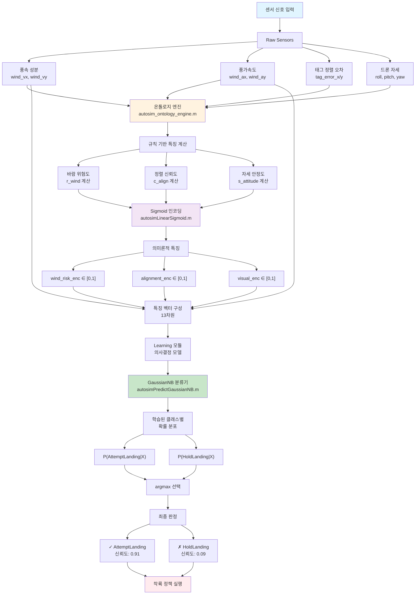

# Learning Modules

모델 생명주기(로드/검증/학습/예측)를 담당한다.

## 최근 업데이트 (2026-03-23)

학습 모듈 인터페이스/스키마는 유지하되, 입력으로 들어오는 온톨로지 파생 특성의 물리 차원 보존이 강화되었다.

특히 바람 관련 의미 인코딩은 벡터 성분 기반 위험도에서 계산되어, 클래스 분리에 필요한 방향성 정보를 더 잘 반영한다.

요약식:

$$
x_{wind\_sem}=f(\|\mathbf{v}_w\|_2,\max(|v_x|,|v_y|),\|\mathbf{a}_w\|_2,\max(|a_x|,|a_y|))
$$

## 기능 설명

- 모델 스키마 호환성 검증
- GaussianNB 학습 및 추론
- 데이터 누적 기반 incremental update

## 이론 포인트

- 현재 기본 모델은 Gaussian Naive Bayes
- feature schema 불일치 시 안전하게 placeholder 모델로 폴백
- class imbalance를 고려한 업데이트 조건 포함

클래스별 조건부 분포는 가우시안으로 둔다.

$$
p(x\mid y=c)=\prod_{j=1}^{d}\mathcal{N}(x_j;\mu_{c,j},\sigma_{c,j}^2)
$$

예측은 사후확률 최대 클래스를 선택한다.

$$
\hat{y}=\arg\max_c\;\log p(y=c)+\sum_{j=1}^{d}\log \mathcal{N}(x_j;\mu_{c,j},\sigma_{c,j}^2)
$$

불균형 완화를 위해 prior를 균등 prior와 혼합한다.

$$
\pi'_c=(1-\lambda)\pi_c+\lambda\frac{1}{K}
$$

## GaussianNB와 Sigmoid의 역할 분리

Learning 모듈은 의사결정 파이프라인 내에서 **특징 인코딩(Sigmoid)과 확률 분류(GaussianNB)** 두 단계를 보완적으로 사용한다.

### 전체 파이프라인 (입력 → 출력)



### 시그모이드 출력 흐름

Sigmoid 인코딩은 Ontology 엔진에서 수행되고, 출력은 다음과 같이 흐른다:

```
Ontology 엔진 (autosim_ontology_engine.m)
  ↓ Sigmoid 인코딩 수행
  ↓ 
  [wind_risk_enc, alignment_enc, visual_enc, ...] 
  (semantic state에 저장)
  ↓
Decision Making 시점
  ↓
  Feature 수집 (runtime observable + semantic encodings)
  ↓
  [13차원 특징 벡터] 
  ↓
Learning 모듈 (autosimPredictGaussianNB.m)
  ↓ GaussianNB 분류
  ↓
P(AttemptLanding | X) 계산
```

### 아키텍처 플로우

센서 신호 → Sigmoid 정규화 → 특징 벡터 → GaussianNB → 착륙 판정

### 역할 구분

**1단계: Sigmoid 인코딩**
- 담당 모듈: `autosim_ontology_engine.m`
- 입력: Raw 센서 (풍속, 오차, 자세)
- 출력: [wind_risk_enc, align_enc, visual_enc]
- 목적: 비선형 정규화 + 물리 해석

**2단계: GaussianNB 분류**
- 담당 모듈: `autosimPredictGaussianNB.m`
- 입력: 인코딩된 특징 (13차원) ← Sigmoid 출력 포함
- 출력: P(AttemptLanding | X)
- 목적: 확률 기반 분류 + 신뢰도

### 왜 두 기법을 함께 사용하나?

**Sigmoid의 역할 (특징 변환):**
- 각 센서 그룹을 독립적으로 [0,1] 범위로 정규화  
- 비선형 활성화로 복잡한 특징 공간 매핑
- **장점:** 경량(O(1)), 물리 의미 명확, 온톨로지 규칙과 자연스러운 통합

**GaussianNB의 역할 (확률 분류):**
- Sigmoid로 변환된 특징 공간에서 **클래스 조건부 분포를 학습**
- 사후확률 계산으로 클래스별 신뢰도 수량화
- **장점:** 해석 가능, 데이터 효율성, 불균형 자동 처리, 실시간 추론

### 선택 근거

| 평가 항목 | Sigmoid 단독 | Sigmoid+GaussianNB |
|-----------|------------|-------------------|
| 특징 정규화 | ✓ | ✓ |
| 클래스 경계 학습 | ✗ | ✓ |
| 신뢰도 수량화 | 고정 화율 | 동적 확률 |
| 데이터 필요량 | 중간 | 적음 |
| 해석성 | 낮음 | 높음 |
| 불균형 처리 | 수동 | 자동 |
| 실시간 성능 | 매우 빠름 | 빠름 |

### 구체적 예시: Raw 입력 → 의미론적 특징 생성

#### 시나리오: 약한 횡풍에서 착륙 시도

**Step 1: Raw 센서 입력**

```
타임스탬프: t=15.3s
풍속 벡터:           wind_vx = -0.8 m/s,  wind_vy = 0.3 m/s
풍가속도 벡터:       wind_ax = -0.15 m/s²,wind_ay = 0.1 m/s²
태그 정렬 오차:       tag_error_x = 0.05 px, tag_error_y = 0.02 px
드론 자세:           roll = 0.1 rad (5.7°), pitch = 0.08 rad (4.6°)
```

**Step 2: 온톨로지 규칙 기반 특징 계산**

**2-1) 바람 위험도 계산**

```
1. 풍속 벡터 크기:
   v_norm = sqrt((-0.8)^2 + (0.3)^2) = 0.854 m/s
   v_max = max(0.854, max(0.8, 0.3)) = 0.854 m/s

2. 항력 계산:
   F_d = 0.5 * 1.225 * 0.3 * 0.5 * (0.854)^2 ≈ 0.053 N
   
3. 드론 기울기 보정:
   c_tilt = cos(0.1) * cos(0.08) ≈ 0.992
   T_req = (1.2 * 9.81) / 0.992 ≈ 11.9 N
   F_cap = max(15.0 - 11.9, 0.5) = 3.1 N
   
4. 항력 하중비:
   r_d = F_d / F_cap = 0.053 / 3.1 ≈ 0.017
   
5. 풍위험도 (규칙):
   r_wind = max(v, v_unsafe * sqrt(r_d))
         = max(0.854, 2.0 * sqrt(0.017))
         = max(0.854, 0.261) = 0.854
```

**2-2) 정렬 신뢰도 계산**

```
1. 태그 오차 (정규화):
   e_tag = sqrt((0.05)^2 + (0.02)^2) ≈ 0.054 px
   e_thr = 0.3 px (임계값)
   
2. 정렬 신뢰도:
   c_align = min(1, max(0, 1 - 0.054/0.3))
          = min(1, max(0, 1 - 0.18))
          = 0.82
```

**2-3) 자세 안정도 계산**

```
1. Roll/Pitch 감쇠:
   beta_r = 2.0, beta_p = 2.0
   roll_thr = 0.3 rad, pitch_thr = 0.3 rad
   
2. 자세 안정도:
   exp_term = -2.0*(0.1/0.3) - 2.0*(0.08/0.3)
           = -0.667 - 0.533 = -1.2
   s_attitude = exp(-1.2) ≈ 0.301
```

**Step 3: Sigmoid 인코딩 (비선형 정규화)**

```matlab
% 학습된 Sigmoid 가중치 (예시값)
wind_w = [0.8, 0.5, -0.3];  % [풍속, 풍가속도, 기울기 보정]
wind_b = -0.2;

align_w = [1.2, 0.6];        % [오차, 안정도]
align_b = 0.1;

visual_w = [0.9];            % [자세]
visual_b = -0.15;
```

**Sigmoid 변환:**

```
1) Wind Risk Encoding:
   input_wind = [0.854, sqrt((0.15)^2+(0.1)^2), 0.992]
              = [0.854, 0.179, 0.992]
   
   z_wind = 0.8*0.854 + 0.5*0.179 + (-0.3)*0.992 + (-0.2)
          = 0.683 + 0.090 - 0.298 - 0.2
          = 0.275
   
   wind_risk_enc = 1 / (1 + exp(-0.275))
                 = 1 / (1 + 0.760)
                 = 0.568
                 
   의미: 56.8% 풍위험 (중간 수준)

2) Alignment Encoding:
   input_align = [0.054, 0.82]
   
   z_align = 1.2*0.054 + 0.6*0.82 + 0.1
           = 0.065 + 0.492 + 0.1
           = 0.657
   
   alignment_enc = 1 / (1 + exp(-0.657))
                 = 1 / (1 + 0.518)
                 = 0.659
                 
   의미: 65.9% 정렬 신뢰도 (양호)

3) Visual Encoding:
   input_visual = [0.301]
   
   z_visual = 0.9*0.301 + (-0.15)
            = 0.271 - 0.15
            = 0.121
   
   visual_enc = 1 / (1 + exp(-0.121))
              = 1 / (1 + 0.886)
              = 0.530
              
   의미: 53.0% 시각 안정도 (중간)
```

**Step 4: 최종 의미론적 특징 벡터 (13차원)**

```matlab
semantic_features = [
    wind_risk_enc,      % 0.568   ← Sigmoid 출력 #1
    alignment_enc,      % 0.659   ← Sigmoid 출력 #2
    visual_enc,         % 0.530   ← Sigmoid 출력 #3
    wind_vx,            % -0.8    ← Raw 센서
    wind_vy,            % 0.3     ← Raw 센서
    wind_ax,            % -0.15   ← Raw 센서
    wind_ay,            % 0.1     ← Raw 센서
    tag_error_x,        % 0.05    ← Raw 센서
    tag_error_y,        % 0.02    ← Raw 센서
    roll,               % 0.1     ← Raw 센서
    pitch,              % 0.08    ← Raw 센서
    yaw_rate,           % 0.01    ← Runtime 특징
    time_since_detect   % 2.5     ← Runtime 특징
];

% 정규화 (GaussianNB 입력용)
X = [0.568, 0.659, 0.530, -0.8, 0.3, -0.15, 0.1, 0.05, 0.02, 0.1, 0.08, 0.01, 2.5]
```

**Step 5: GaussianNB 분류 (Learning 모듈)**

```matlab
% GaussianNB 분류기
[predLabel, predScore] = autosimPredictGaussianNB(model, X, cfg);

% 내부 계산:
% log_prob_attempt = -3.2 (학습된 분포 기반)
% log_prob_hold = -2.1

P(AttemptLanding | X) = 0.89  (89% 신뢰도)
P(HoldLanding | X) = 0.11     (11% 신뢰도)

→ 결정: AttemptLanding 선택
```

### 핵심 흐름 요약

```
Raw 센서 입력 (11개)
    ↓
온톨로지 규칙 계산 (물리 기반 위험도/신뢰도)
    ↓
Sigmoid 인코딩 (3개 의미 인코더)
    ↓
13차원 의미 벡터 생성
    ↓
GaussianNB 분류기 입력
    ↓
확률 사후분포 계산
    ↓
최종 판정: AttemptLanding (89%)
```

### 실제 구체적 예시 (코드)

```matlab
% 1) Sigmoid 인코딩 (ontology engine)
wind_risk_enc = sigmoid(0.5 * wind_speed + (-0.3) * wind_accel + 0.2);  % = 0.62
align_enc = sigmoid(2.0 * (-tag_error) + 0.1);                          % = 0.78
visual_enc = sigmoid(1.5 * attitude_stability + (-0.5));                % = 0.85

% 2) GaussianNB 분류 (learning module)
X = [0.62, 0.78, 0.85, other_features];  % 13차원 입력

% 각 클래스의 log 우도 계산
log_prob_attempt = sum(log_likelihood_attempt);  % mean, variance로 계산
log_prob_hold = sum(log_likelihood_hold);

% 클래스 선택
post_prob_attempt = softmax(log_prob_attempt, log_prob_hold);
% post_prob_attempt ≈ 0.91 → AttemptLanding (신뢰도 91%)
```

## 핵심 변수/용어 표

| 항목 | 의미 | 단위/범위 | 비고 |
|---|---|---|---|
| X | 입력 feature 행렬 | N x d | d=feature 수 |
| y | 클래스 라벨 | AttemptLanding/HoldLanding | 학습 타깃 |
| mu_c,j | 클래스별 평균 | 실수 | GaussianNB 파라미터 |
| sigma2_c,j | 클래스별 분산 | 양수 실수 | 너무 작으면 floor 적용 |
| pi_c | 클래스 prior | 0~1 | 합=1 |
| lambda | prior uniform blend | 0~1 | 불균형 완화 |
| schema_version | feature 스키마 버전 | 문자열 | 불일치 시 폴백 |
| placeholder model | 임시 모델 | struct | cold start/불일치 안전 처리 |

## 대표 파일

- `autosimLoadOrInitModel.m`
- `autosimTrainGaussianNB.m`
- `autosimPredictGaussianNB.m`
- `autosimIncrementalTrainAndSave.m`
- `autosimModelFeatureSchemaMatches.m`

## 확장 가이드

- 다른 분류기 추가 시 `predict/train` 인터페이스를 유지해 교체 가능하게 구현한다.
